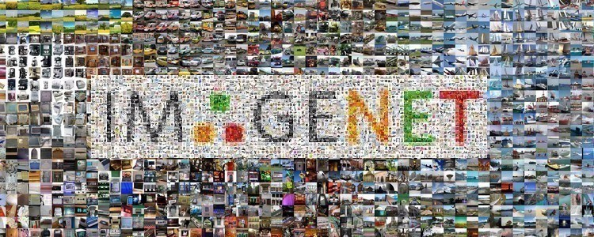
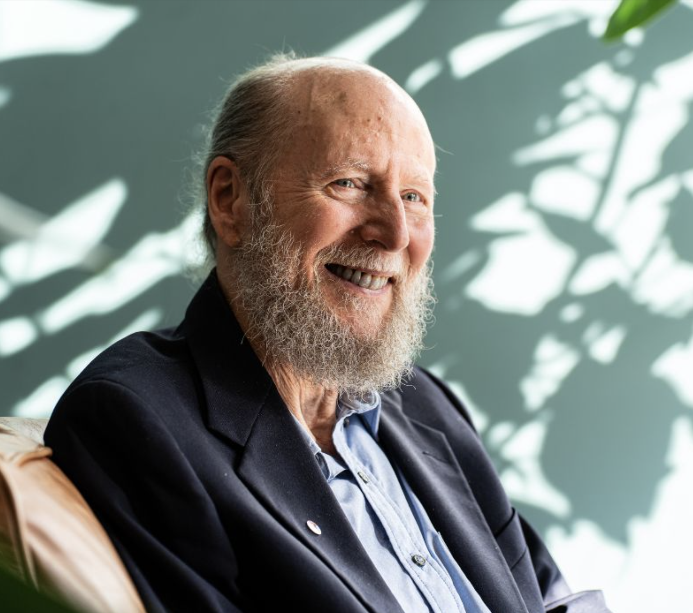
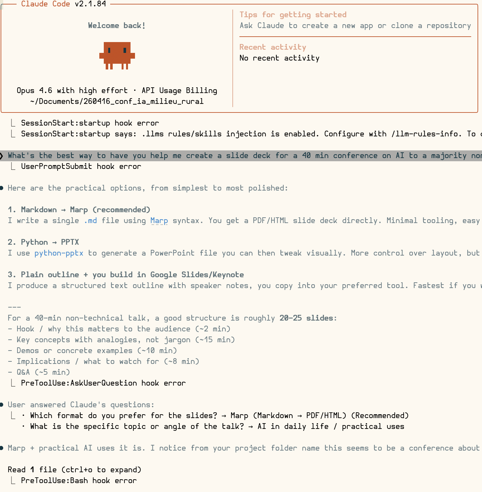
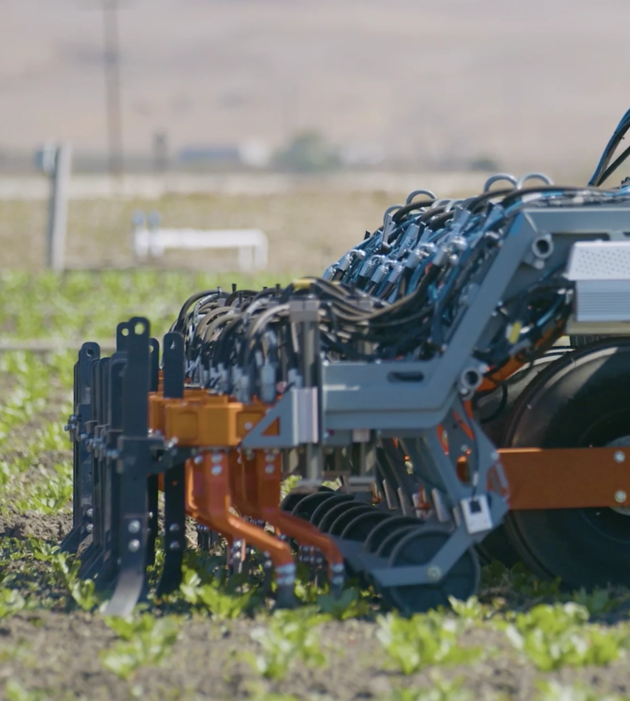

<!-- _class: lead -->

# L'intelligence artificielle

### Ce que c'est vraiment, à quoi ça sert, et ce que ça change pour vous

Timothée Darcet
Chercheur en IA — FAIR (Meta), Paris

<!--
~30 sec. Se présenter rapidement et lancer.
-->

---

# Qui suis-je

- Chercheur chez **FAIR** (Fundamental AI Research), le labo de recherche en IA de **Meta**, à Paris
- Thèse entre **FAIR Paris** et **INRIA Grenoble**
  - Apprentissage auto-supervisé (DINOv2)
  - Compréhension des vision transformers
- Avant : **École polytechnique**, **ENS** (master MVA)

Je travaille sur les **grands modèles de langage** — les technologies derrière ChatGPT, Claude, etc.

<!--
~1 min. Poser sa crédibilité sans en faire trop.
-->

---

<!-- _class: lead -->

# C'est quoi, « l'intelligence artificielle » ?

<!--
Rapidement, petit sondage à main levée, qui sont ceux parmi vous qui savent ce que c'est que l'IA?
...
Mauvaise réponse. Moi-même je suis pas sûr de savoir.
-->

---

# IA : une définition ?

Honnêtement ? Il n'y en a pas de bonne.

&rarr; "IA" est un **fourre-tout**.
&rarr; La définition change avec le temps.

> En 1970, reconnaître des caractères écrits avec une photo, c'était de l'IA.
> Aujourd'hui, le téléphone le fait quand on scanne un document.

**Retenir :** « IA » comme argument de vente &rarr; méfiance.
C'est devenu un buzzword. Ce qui compte, c'est **ce que ça fait concrètement**.

<!--
~1 min 30. Planter le décor : on ne va pas se raconter des histoires.
-->

---

<!-- _class: lead -->

# Un peu d'histoire

### Pour comprendre d'où ça vient
<!--
Si on peut pas définir ce mot, malheureusement, il va falloir aller voir *derrière* le mot. Comprendre le sens.
Et pour ça, un peu d'histoire
-->

---

# 1956 — Dartmouth
Quelques chercheurs se réunissent pour un été au Dartmouth College.

But : la machine intelligente. Il faut un nom.

Cybernétique ? Théorie des automates ? Traitement de l'information complexe ?

**John McCarthy propose « Artificial Intelligence ».** Le nom reste.

> *« What came out of Dartmouth? I think the main thing was the concept of artificial intelligence as a branch of science. »*
> — John McCarthy

<!--
C'est la première fois qu'on parle d'IA

McCarthy s'est dit "si j'appelle ça de la cybernétique, il y a Norbert là le grand guru de la cybernétique qui va venir m'emmerder. Donc je vais créer un autre nom.
-->

---
# 1966: ELIZA, la fausse psy

Joseph Weizenbaum crée **ELIZA** : un programme qui imite un psychothérapeute.

En fait: ELIZA ne comprend rien. Elle reformule en questions.

> *— Je me sens triste.*
> *— Pourquoi vous sentez-vous triste ?*

Les gens étaient convaincus de parler à quelqu'un d'intelligent. 

**Leçon :** on est très facilement dupés. On projette de l'intelligence là où il n'y en a pas.

<!--
L'"effet ELIZA" à l'époque
-->

---

# Les hivers de l'IA

L'IA a connu **des cycles d'enthousiasme et de déception** :

- **Années 70-80** : promesses démesurées pas réalisées → financements coupés
- **Années 90-2010** : l'IA est passée de mode, plus personne n'en parle

À chaque cycle, les promesses dépassent la réalité, la déception suit.

On est dans une phase d'enthousiasme en ce moment. L'histoire invite à la prudence.

<!--
A une époque, les startups préféraient pas dire "intelligence artificielle", ou "robotique" parce que ils avaient l'air d'illuminés qui promettent de la science-fiction impossible. Personne investit dans un illuminé

Honnêteté sur les cycles. Ne pas prétendre que « cette fois c'est différent ».
Mais ça veut pas dire que ça va forcément se crasher!
-->

---

# L'approche classique : programmer des règles

Les premières décennies, on essaie de coder l'intelligence **à la main** :

- **Si** le patient a de la fièvre **et** tousse → grippe probable
- **Si** la pièce d'échecs est menacée → la déplacer

Ça marche... pour des problèmes simples et bien définis.

Ça échoue dès que le monde réel est trop complexe ou ambigu.

<!--
~1 min. Transition vers le machine learning.
-->

---

# L'apprentissage  : un autre paradigme

Plus de règles, on **montre des exemples**.

- 1000 photos de chats, 1000 photos de chiens
- Elle apprend à les distinguer toute seule
- On ne lui a jamais dit « un chat a des moustaches et des oreilles pointues»

Communément appelé **machine learning** (apprentissage machine) ou ML.

**Aujourd'hui, quand on dit IA, on entend  ML.**

<!--
~1 min 30. C'est le concept clé de la présentation.
-->

---

# Les réseaux de neurones

Le machine learning le plus efficace utilise des **réseaux de neurones** : des couches de calcul empilées, **vaguement** inspirées du cerveau.

L'idée existe depuis les années 50.
Pendant longtemps, ça ne marchait pas.

Ce qui a changé :
- **puissance de calcul** (GPUs)
- **quantité de données** disponibles (internet).

<!--
~1 min. Pas besoin de rentrer dans les détails techniques.
-->

---

# 2012 — AlexNet : le déclic

Un réseau de neurones écrase la compétition sur la reconnaissance d'images.

Avant : les méthodes artisanales dominaient.
Après : tout le monde passe aux réseaux de neurones.

C'est le début de la révolution actuelle de l'IA.

<!--  -->
---

# The Bitter Lesson (leçon amère)

Richard Sutton, 2019 :

> *Les méthodes qui gagnent à long terme sont celles qui savent exploiter le plus de calcul et le plus de données — pas les plus ingénieuses.*

Autrement dit : l'intelligence humaine dans la conception des méthodes perd face à la la force brute.

C'est frustrant pour les chercheurs.
Mais c'est ce qu'on observe depuis 70 ans.

<!--
~1 min. Important pour comprendre pourquoi la course au calcul est si intense.
-->

---

# 2020 — GPT-3 : prédire le mot suivant, à grande échelle

**Le principe :** on prend tout internet, et on entraîne un réseau de neurones à prédire le mot suivant dans une phrase.

> « Le chat s'assoit sur le ___ » → **tapis** (ok), **toit** (ok), **président** (bof)

Juste de l'autocomplétion. Mais à une échelle gigantesque.

Et ça marche étonnamment bien : le modèle peut répondre à des questions, résumer, traduire, coder.

On appelle ça un **grand modèle de langage** (LLM).

---

# 2022 — ChatGPT : l'IA dans la poche

OpenAI propose un **grand modèle de langage** comme GPT3 en ligne.

100 millions d'utilisateurs en 2 mois. Du jamais vu.

Scientifiquement, ce n'est pas si nouveau. Mais :
- La vision du modèle en tant que produit est nouvelle
- Monsieur tout-le-monde découvre
- Afflux gigantesque de fonds et d'attention
- C'est ce qui lance la vague actuelle de l'IA

---

# 2025 — Claude Code, Codex : l'IA qui code

Aujourd'hui, les chatbots ne font pas que répondre à des questions.

Certains peuvent **écrire du code**, **modifier des fichiers**, **lancer des commandes**, **débugger des programmes**.

Ces slides ont d'ailleurs été écrites avec l'aide de Claude Code.

On passe de l'IA assistant à l'IA **agent** — elle exécute des tâches, pas juste des réponses.

<!--
~1 min. Montrer que ça avance vite. Ces slides en sont un exemple concret.
Side note c'est un peu cher ces trucs.
-->

<!--  -->
---

# Alors, c'est quoi l'IA ?

Après 70 ans, honnêtement :

**C'est ce qu'on ne sait pas encore bien faire avec un ordinateur.**

Dès qu'on sait le faire, ça cesse d'être de l'IA et ça devient juste... de l'informatique.

C'est pour ça que la définition bouge sans arrêt.

Ce qui compte'hui, ce n'est pas la définition — c'est **ce que ça permet de faire**.

<!--
J'exagère un peu. Mais pas tant que ça.
-->

---

<!-- _class: lead -->

# Quelques applications dans le monde rural

---

# FarmWise

Des **robots autonomes** qui parcourent les champs et désherbent mécaniquement, plant par plant.

- Pas de produit chimique
- Reconnaissance visuelle de chaque plante
- Fonctionne de jour comme de nuit

C'est réel. C'est en service dans des exploitations aujourd'hui.

<!--
~1 min. Montrer une photo/vidéo si possible.
-->

---

# Inarix

Startup française : analyse de la **qualité des grains** avec un smartphone.

- Vous prenez une photo de votre récolte
- L'IA évalue la qualité (taux de protéines, calibre, etc.)
- Résultat en quelques secondes

Utilisé par des coopératives en France. Pas de matériel spécial, juste votre téléphone.

<!--
~1 min.
-->

---

# Pl@ntNet

Projet **français** (INRIA, CIRAD, IRD) : identification de plantes par photo.

- 40 000+ espèces reconnues
- Gratuit, collaboratif
- Utile pour identifier adventices, espèces invasives, biodiversité locale

> C'est de la recherche publique française. C'est gratuit. Ça marche.

---

# Plantix

Diagnostic des **maladies de cultures** par photo.

- Prenez une photo d'une feuille malade
- L'appli identifie le problème et propose des traitements
- 30+ cultures couvertes

Pas un remplacement du technicien. Mais un premier diagnostic immédiat, dans le champ.

<!--
~1 min.
-->

---

# Et aussi...

- **Images satellite** pour le suivi des parcelles (stress hydrique, croissance)
- **Capteurs connectés** pour l'élevage (détection des chaleurs, boiteries, vêlages)
- **Prévisions météo locales** de plus en plus fines grâce à l'IA
- **Optimisation des tournées** de collecte, livraison, transport à la demande

L'IA ne va pas révolutionner l'agriculture du jour au lendemain.
Mais elle apporte des outils concrets, **dès maintenant**.

<!--
~1 min 30.
-->

---

<!-- _class: lead -->

# En pratique, pour moi et mon personnel ?

---

# Une seule manière d'apprendre : utiliser

Pas de cours magistral qui remplace la pratique.

**Essayez.** Posez une question à un chatbot. Demandez-lui de vous aider à rédiger un mail, à résumer un document, à préparer un devis.

Parfois ça marchera, parfois non. C'est normal.

L'important c'est de se faire sa propre idée, c'est bien plus efficace que d'en parller pendant des heures.

<!--
~1 min.
-->

---

# Lequel ?

Les bonnes références :
- **Claude** (Anthropic): je recommande
- **Gemini** (Google): souvent très bon
- **ChatGPT** (OpenAI): classique, modèle gratuit ok

Attention :
- Les meilleurs modèles sont souvent payants
- Ne jugez pas « l'IA » sur un mauvais modèle gratuit

<!--
~1 min 30. Être honnête : les modèles gratuits sont souvent décevants.
-->

---

# Ça ne marche pas à tous les coups

- Parfois le résultat est excellent. Parfois c'est n'importe quoi.
- Un modèle peut réussir là où un autre échoue.
- Les modèles **s'améliorent très vite**, ce qui ne marche pas aujourd'hui marchera peut-être dans quelques mois / années.

Ne pas se décourager trop vite.
Ne pas faire confiance aveuglément.
**Vérifier, vérifier, vérifier.**

<!--
~1 min.
-->

---

# Pour l'informatique : Claude Code, Codex

Si vous ou votre personnel faites de la gestion informatique (site web, tableurs, bases de données) :

- **Claude Code**, **Codex** : l'IA écrit et modifie du code à votre place
- Pas strictement besoin d'être développeur mais c'est mieux

C'est là que le gain de productivité est le plus spectaculaire aujourd'hui.

Par contre c'est cher (15 EUR/mois min, 85 EUR/mois pour une utilisation intensive)

---

# Ce qu'il faut retenir

- Pas de magie. C'est un outil. Parfois puissant, parfois décevant.
- **Il faut essayer** pour se faire une idée.
- Mais il faut aussi **être prêt** : ceux qui savent s'en servir auront un avantage.

> Ce n'est pas l'IA qui va vous remplacer.
> C'est quelqu'un qui sait utiliser l'IA.

---

<!-- _class: lead -->

# Et demain ?

### L'intelligence artificielle générale

---

# AGI : de quoi parle-t-on ?

**Artificial General Intelligence** : une IA qui serait capable de faire tout ce qu'un humain fait intellectuellement.

La plupart des IA sont **spécialisées** :
- AlphaFold prédit des protéines, mais ne sait pas faire une addition
- Votre GPS calcule un itinéraire, point.

L'AGI serait une IA **polyvalente**, capable d'apprendre n'importe quoi. 

<!--
~1 min 30.
-->

---

# Est-ce que c'est pour bientôt ?

Honnêtement : **personne ne sait.**

- Certains disent « dans 5 ans ». D'autres disent « peut-être jamais ». D'autres disent « elle est déjà là »
- Je ne pense pas que ce soit le cas pour les modèles actuels.
- Les progrès sont rapides, mais les obstacles fondamentaux, et même l'objectif lui-même, restent mal compris.

<!--
~1 min 30.
-->

---

# Conscience ? Terminator ?

**Est-ce que les modèles actuels sont conscients ?**
Je pense que non. C'est débatable.

**Est-ce que c'est possible un jour ?**
Je pense que oui. C'est débatable.

**Terminator ?**
Non. Les risques réels de l'IA sont plus banals : biais, désinformation, concentration du pouvoir, surveillance.

Les vrais dangers sont ennuyeux, pas spectaculaires.
C'est pour ça qu'on en parle moins.

---

<!-- _class: lead -->

# Merci

### Questions ?
