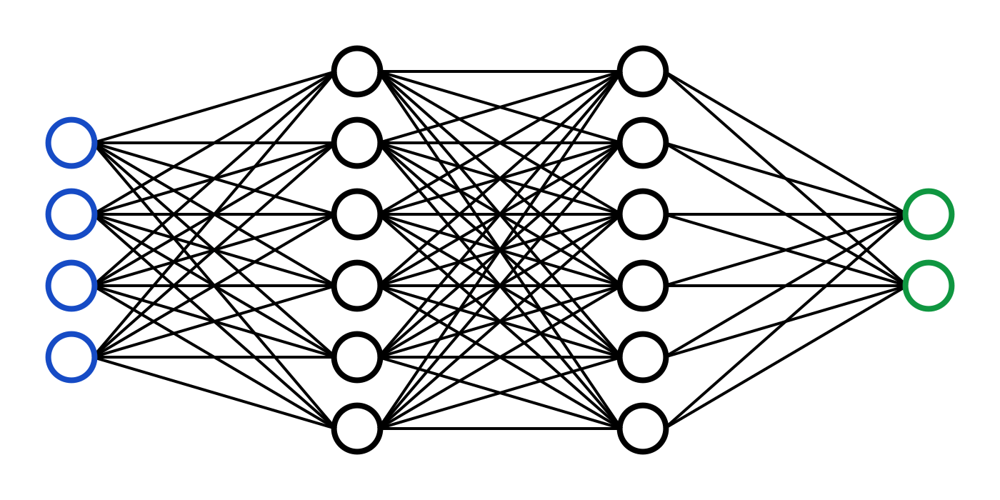
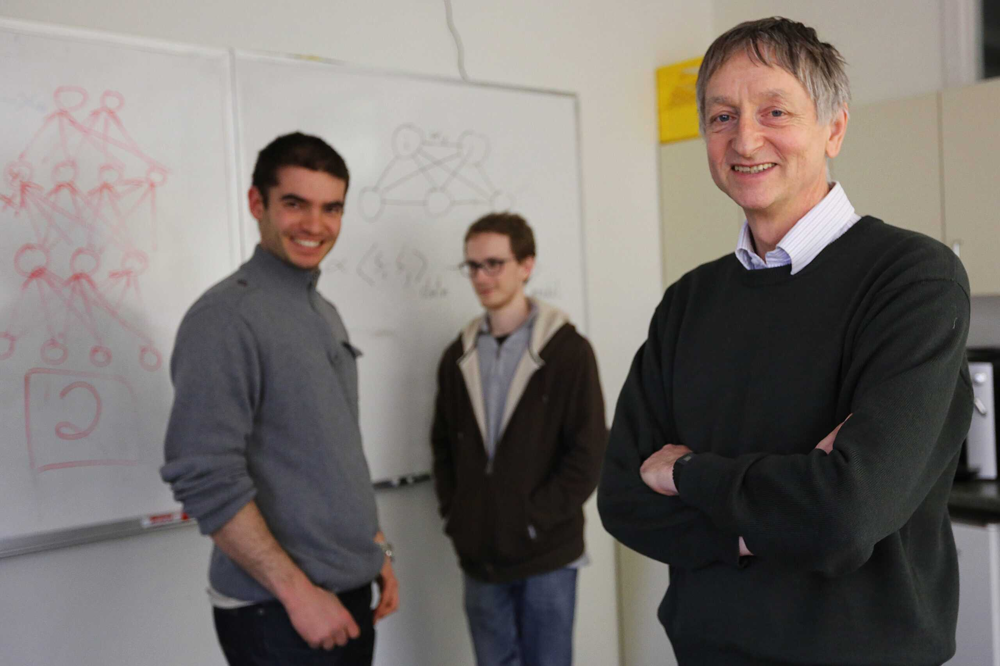
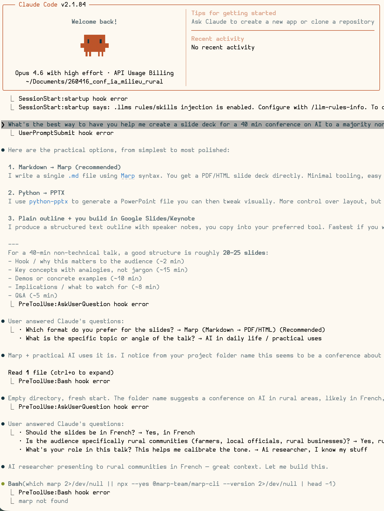
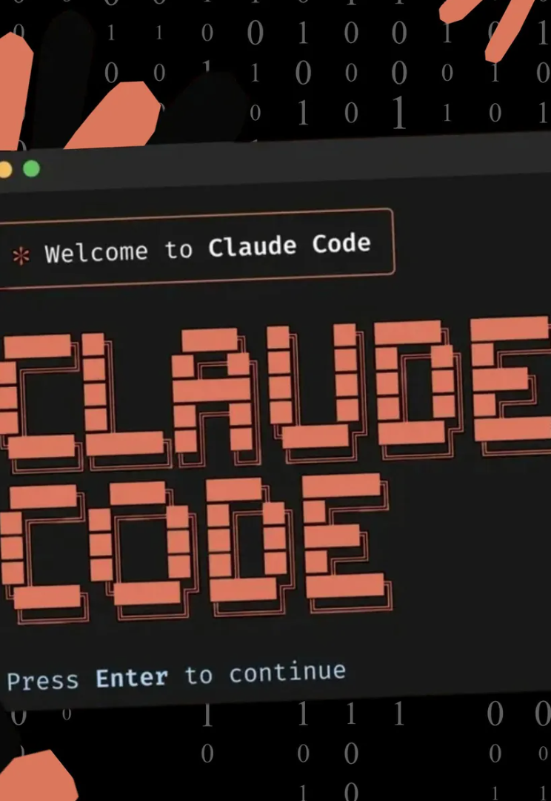
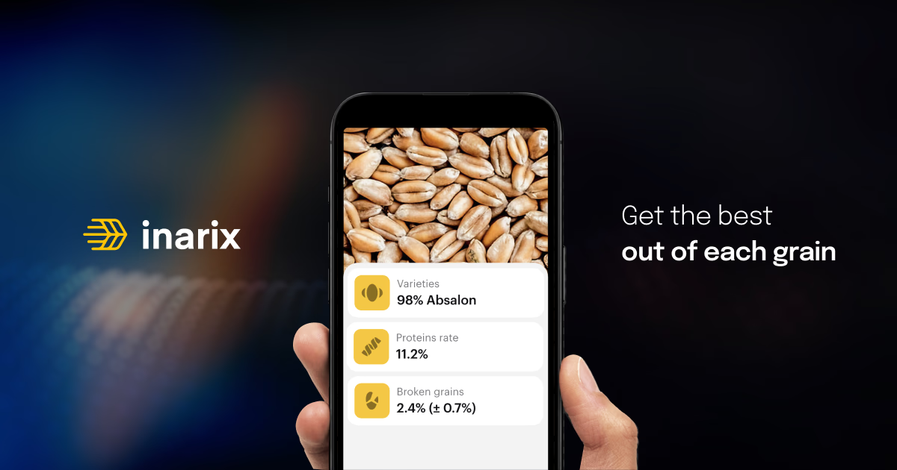

<!-- _class: lead -->

# L'intelligence artificielle

<!-- ### Ce que c'est vraiment, à quoi ça sert, et ce que ça change pour vous -->

Timothée Darcet
Chercheur - FAIR (Meta), Paris

<!--
~30 sec. Se présenter rapidement et lancer.
-->

---

# Qui suis-je

- Chercheur chez **FAIR** (Fundamental AI Research), le labo de recherche en IA de **Meta**, à Paris
- Thèse entre **FAIR Paris** et **INRIA Grenoble**
  - Apprentissage auto-supervisé (DINOv2)
  - Compréhension des vision transformers
- Avant : École polytechnique, ENS (master MVA)

Je travaille sur les **grands modèles de langage** (LLM) - les technologies derrière ChatGPT, Claude, etc.

---

<!-- _class: lead -->

# C'est quoi, « l'intelligence artificielle » ?

<!--
Rapidement, petit sondage à main levée, qui sont ceux parmi vous qui savent ce que c'est que l'IA?
...
Mauvaise réponse. Moi-même je suis pas sûr de savoir.
-->

---

# IA : une définition ?

Honnêtement ? Il n'y en a pas de bonne.

&rarr; "IA" est un **fourre-tout**.
&rarr; La définition change avec le temps.

> En 1970, reconnaître des caractères écrits avec une photo, c'était de l'IA.
> Aujourd'hui, le téléphone le fait quand on scanne un document.

**Retenir :** « IA » comme argument de vente &rarr; méfiance.
C'est devenu un buzzword. Ce qui compte, c'est **ce que ça fait concrètement**.

---

<!-- _class: lead -->

# Un peu d'histoire

### Pour comprendre d'où ça vient
<!--
Si on peut pas définir ce mot, malheureusement, il va falloir aller voir *derrière* le mot. Comprendre le sens.
Et pour ça, un peu d'histoire
-->

---

# 1956 - Dartmouth
Quelques chercheurs se réunissent pour un été au Dartmouth College.

But : la machine intelligente. Il faut un nom.

Cybernétique ? Théorie des automates ? Traitement de l'information complexe ?

**McCarthy propose « Artificial Intelligence ».**

> *« What came out of Dartmouth? I think the main thing was the concept of artificial intelligence as a branch of science. »*
> - John McCarthy

<!--
C'est la première fois qu'on parle d'IA

McCarthy s'est dit "si j'appelle ça de la cybernétique, il y a Norbert là le grand guru de la cybernétique qui va venir m'emmerder. Donc je vais créer un autre nom.
-->

---
# 1966: ELIZA, la fausse psy

Joseph Weizenbaum crée **ELIZA** : un programme qui imite un psychothérapeute.

En fait: ELIZA ne comprend rien. Elle reformule en questions.

> *- Je me sens triste.*
> *- Pourquoi vous sentez-vous triste ?*

Les gens étaient convaincus de parler à quelqu'un d'intelligent. 

**Leçon :** on est très facilement dupés. On projette de l'intelligence là où il n'y en a pas.

<!--
L'"effet ELIZA" à l'époque
-->

---

# Les hivers de l'IA

L'IA a connu **des cycles d'enthousiasme et de déception** :

- **Années 70-80** : promesses démesurées pas réalisées → financements coupés
- **Années 90-2010** : l'IA est passée de mode, plus personne n'en parle

À chaque cycle, les promesses dépassent la réalité, la déception suit.

<!-- On est dans une phase d'enthousiasme en ce moment. L'histoire invite à la prudence. -->

<!--
A une époque, les startups préféraient pas dire "intelligence artificielle", ou "robotique" parce que ils avaient l'air d'illuminés qui promettent de la science-fiction impossible. Personne investit dans un illuminé

Honnêteté sur les cycles. Ne pas prétendre que « cette fois c'est différent ».
Mais ça veut pas dire que ça va forcément se crasher!
-->

---

# L'approche classique : programmer des règles

Les premières décennies, on essaie de coder l'intelligence **à la main** :

- **Si** le patient a de la fièvre **et** tousse → grippe probable
- **Si** la pièce d'échecs est menacée → la déplacer

Ça marche... pour des problèmes simples et bien définis.

Ça échoue dès que le monde réel est trop complexe ou ambigu.

<!--
~1 min. Transition vers le machine learning.
-->

---

# L'apprentissage  : un autre paradigme

Plus de règles, on **montre des exemples**.

- 1000 photos de chats, 1000 photos de chiens
- Elle apprend à les distinguer toute seule
- On ne lui a jamais dit « un chat a des moustaches et des oreilles pointues»

Communément appelé **machine learning** (apprentissage machine) ou ML.

**Aujourd'hui, quand on dit IA, on entend  ML.**

<!--
~1 min 30. C'est le concept clé de la présentation.
-->

---

# Les réseaux de neurones

Le machine learning le plus efficace utilise des **réseaux de neurones** : des couches de calcul empilées, **vaguement** inspirées du cerveau.

L'idée existe depuis les années 50.
Pendant longtemps, ça ne marchait pas.

Ce qui a changé :
- **puissance de calcul** (GPUs)
- **quantité de données** disponibles (internet).

<!--
~1 min. Pas besoin de rentrer dans les détails techniques.
insiste sur "vaguement"
-->

---

# 2012 - AlexNet : le déclic

Un réseau de neurones écrase la compétition sur la reconnaissance d'images.

Avant : les méthodes artisanales dominaient.
Après : tout le monde passe aux réseaux de neurones.

C'est le début de la révolution actuelle de l'IA.

---

# 2020 - GPT-3 : le mot suivant, à grande échelle

**Le principe :** on prend tout internet, et on entraîne un réseau de neurones à prédire le mot suivant dans une phrase.

> « Le chat mange ___ » → **tourner** (non)
> « Le chat mange ___ » → **le président** (bof)
> « Le chat mange ___ » → **le gateau** (ok)
> « Le chat mange ___ » → **la souris** (probable!)

Juste de l'autocomplétion. Mais à une échelle gigantesque.

Et ça marche étonnamment bien : répondre à des questions, résumer, traduire, coder...

On appelle ça un **grand modèle de langage** (LLM).

C'est aussi souvent désigné par le terme « IA générative »

---

# 2022 - ChatGPT : l'IA dans la poche

OpenAI propose un **grand modèle de langage** comme GPT3 en ligne.

100 millions d'utilisateurs en 2 mois. Du jamais vu.

Scientifiquement, ce n'est pas si nouveau. Mais :
- La vision du modèle en tant que produit est nouvelle
- Monsieur tout-le-monde découvre
- Afflux gigantesque de fonds et d'attention
- C'est ce qui lance la vague actuelle de l'IA

---

# 2025 - Claude Code, Codex : l'IA qui code

Aujourd'hui, les chatbots ne font pas que répondre à des questions.

Certains peuvent **écrire du code**, **modifier des fichiers**, **lancer des commandes**, **débugger des programmes**.

Ces slides ont d'ailleurs été écrites avec l'aide de Claude Code.

On passe de l'IA assistant à l'IA **agent** - elle exécute des tâches, pas juste des réponses.

<!--
~1 min. Montrer que ça avance vite. Ces slides en sont un exemple concret.
Side note c'est un peu cher ces trucs.
-->

---

# Alors, c'est quoi l'IA ?

Après 70 ans, honnêtement :

**C'est ce qu'on ne sait pas encore bien faire avec un ordinateur.**

Dès qu'on sait le faire, ça cesse d'être de l'IA et ça devient juste... de l'informatique.

C'est pour ça que la définition bouge sans arrêt.

Ce qui compte'hui, ce n'est pas la définition - c'est **ce que ça permet de faire**.

<!--
J'exagère un peu. Mais pas tant que ça.
-->

---

<!-- _class: lead -->

# En pratique

---

# Lequel ?

Les bonnes références :
- **Claude** (Anthropic): je recommande
- **Gemini** (Google): bon, en particulier pour générer des images
- **ChatGPT** (OpenAI): classique, modèle gratuit ok

Attention :
- Les meilleurs modèles sont souvent payants
- Ne jugez pas « l'IA » sur un mauvais modèle gratuit

---

# Une seule manière d'apprendre : utiliser

Aucun cours magistral remplacera la pratique.

**Essayez.** Posez une question à un chatbot. Demandez-lui de:
- rédiger un mail
- résumer un document
- préparer un devis
- suggérer des idées de produits
- expliquer un concept difficile

---

# Les bons tuyaux (en vrac)

- Donner toutes les infos nécessaires, pas une de plus.

- Ouvrez des nouvelles conversation ! Les trop longues conversations rendent les modèles confus

- Itérer: pas just "1 question, 1 réponse". Clarifiez, corrigez, réorientez...

- Procéder par étapes: plan global, puis sujets précis, puis résumer

- Tenter de reformuler, poser la question différemment.
- **Expérimenter**

<!--

eg clarifications:
écrit un mail. Non, moins pompeux. corrige ce chiffre il est faux. Bon finalement met le sous forme de message whatsapp ce sera mieux. Bon relis le message pour les fautes d'orthographes

eg etapes:
J"ai cette idée de business: fais moi un mini business plan
ok quel marché on vise, il fait quel taille?
c'est quoi le business modèle?
Est-ce qu'on a un avantage compétitif?
Niveau marketing, une idée générale, basique?
quelles sont les métriques à suivre?
projections financières initiales on a quoi?
Résume tout: est-ce que ça tient la route?

Expérimenter => perdre du temps (les expériences, ça échoue). C'est ok.
 -->

---

# Ça ne marche pas à tous les coups

- Parfois le résultat est excellent. Parfois c'est n'importe quoi.
- Comprendre les bons **et les mauvais** cas d'usage
  - résumer, reformuler, expliquer: **OUI**.
  - infos factuelles, calculs, avis objectif: **NON**.
- Un modèle peut réussir là où un autre échoue.
- Les modèles **s'améliorent très vite**, ce qui ne marche pas aujourd'hui marchera peut-être dans quelques mois / années.

Ne pas se décourager trop vite.
Ne pas faire confiance aveuglément.
**Vérifier, vérifier, vérifier.**

---

# Pour l'informatique : Claude Code, Codex

Si vous / votre personnel faites de l'informatique (site web, bases de données, ...)

- écrit, modifie et *exécute* du code
- plutôt orienté développeurs

C'est là que le gain de productivité est le plus spectaculaire aujourd'hui.

Un peu cher (15 à 85 EUR/mois/personne)

J'utilise ces modèles au quotidien

---

# Inarix, Plantix

Analyse de photos automatiques: qualité de graines (Inarix), maladies de cultures (Plantix)

- Prendre une photo d'une récolte, d'une feuille malade...
- L'IA estime des mesures, identifie des problèmes...
- Résultat en qques secondes. Pas parfait ! Mais un bon début.

Utilisé par des coopératives en France. Pas de matériel spécial, juste un téléphone.

---

# Pl@ntNet

Projet **français** (INRIA, CIRAD, IRD) : identification de plantes par photo.

- 40 000+ espèces reconnues
- Gratuit, collaboratif

> C'est de la recherche publique française. C'est gratuit. Ça marche.

<!-- 
Ca se voit que c'est pas un perigourdin qui l'a fait: ca fait pas les champignons
Ca fait pas les champis, bons vous vous avez pas besoin mais moi ça me servirait bien -->

---

# Qu'est ce que ça change?

Internet a démocratisé l'accès à l'**information**.

L'IA démocratise l'accès à la **compétence**.

→ Pas besoin de chercher un ingénieur spécialisé qui sait  se servir de MongoDB; mon ingé habituel + Claude code feront l'affaire

Les IA sont tout autant accessibles à New York, San Francisco, ou Bergerac !

**Être prêt** : ceux qui savent s'en servir auront un avantage.

> Certains jobs disparaissent, certains restent
> Mais tous changent
<!-- 

-->

---

<!-- _class: lead -->

# Et demain ?

### L'intelligence artificielle générale

---

# AGI : de quoi parle-t-on ?

**Artificial General Intelligence** : une IA qui serait capable de faire tout ce qu'un humain fait intellectuellement.

La plupart des IA sont **spécialisées** :
- AlphaFold prédit des protéines, mais ne sait pas faire une addition
- Votre GPS calcule un itinéraire, point.

L'AGI serait une IA **polyvalente**, capable d'apprendre n'importe quoi. 

<!--
la def est floue mais généralement c'est
"non mais ton truc là il est """intelligent""", mais bon pas vraiment, pas comme toi et moi tu vois"
-->

---

# Est-ce que c'est pour bientôt ?

Honnêtement : **personne ne sait.**

- Certains disent « elle est déjà là ». D'autres disent « peut-être jamais ». D'autres disent « dans 5 ans ».
- Je ne pense pas que ce soit le cas pour les modèles actuels.
- Les progrès sont rapides, mais les obstacles fondamentaux et, même, l'objectif lui-même, restent mal compris.

---

# Conscience, ou science de cons?

Question beaucoup plus philosophique.

**Est-ce que les modèles actuels sont conscients ?**
Je pense que non. C'est débatable.

**Est-ce que c'est possible un jour ?**
Je pense que oui. C'est débatable.

**Quels sont les risques ?**
C'est pas un film de science-fiction. Les risques sont plus banals : biais, désinformation, concentration du pouvoir...

Les vrais dangers sont ennuyeux, pas spectaculaires.
C'est pour ça qu'on en parle moins.

---

# Pour conclure

- La définition de "IA" est **floue**, et elle a variée
- La vague actuelle est celle des **modèles de langage (LLM)**: des machines à prédire le mot manquant.
- On les crée par **apprentissage machine (ML)**: en leur montrant des données.
- Il faut utiliser pour apprendre. **Expérimentez!**
- On se fait facilement duper par ce qui *a l'air* intelligent. **Vérifiez!**
- Nos IA ne sont pas consciente. **Mais ça pourrait arriver un jour!**

---

<!-- _class: lead -->

# Merci

### Questions ?

<!-- 
questions possibles:
Revenir sur, et définir, l'IA générative
 -->